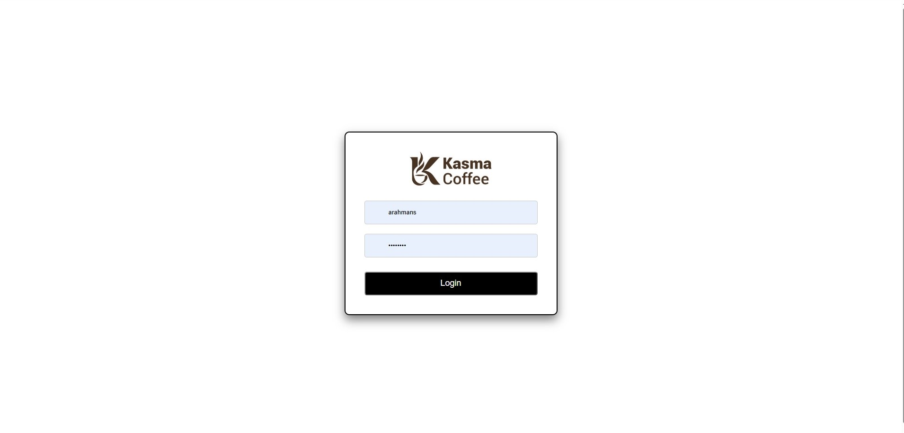
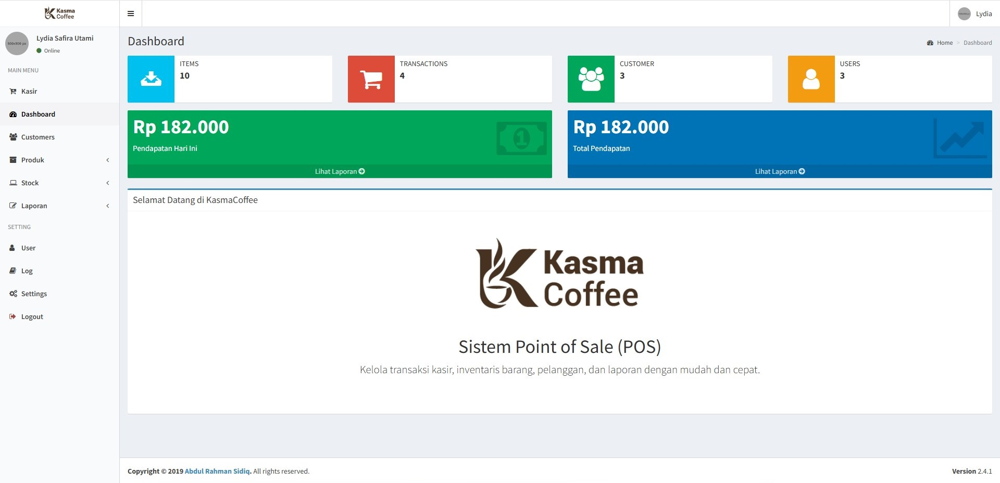
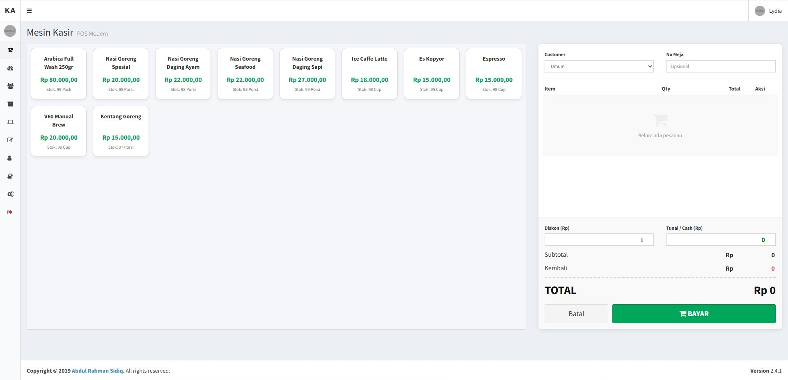

# kasmacoffee-app

> Proyek POS / Sistem Kasir Kedai Kopi yang dikembangkan pada tahun 2019. Memiliki fitur transaksi, kelola stok barang, dan laporan penjualan menggunakan framework PHP CodeIgniter 3.

## 📸 Preview Aplikasi

*(Tambahkan gambar screenshot aplikasi dari folder `previews` di bawah ini)*




*(Ganti nama file gambar sesuai dengan yang ada di folder previews)*

## 🚀 Fitur Utama

- **Autentikasi:** Login multi-level (Kasir & Admin).
- **Manajemen Transaksi (Kasir):** Proses Point of Sale (POS) yang cepat dan mudah.
- **Kelola Produk & Stok:** Manajemen data barang, kategori, satuan, dan penyesuaian stok masuk/keluar.
- **Manajemen Pelanggan:** Pencatatan data pelanggan (Customer).
- **Laporan:** Laporan penjualan secara periodik.
- **Pengaturan & Profil:** Manajemen data toko dan profil pengguna.

## 🛠️ Teknologi yang Digunakan

- **Framework Backend:** PHP CodeIgniter 3
- **Frontend / UI:** AdminLTE (Bootstrap)
- **Database:** MySQL
- **Bahasa:** PHP (Direkomendasikan PHP 7.2 - 7.4), HTML, CSS, JavaScript (jQuery)

## ⚙️ Persyaratan Sistem (System Requirements)

Karena ini merupakan proyek tahun 2019, disarankan menggunakan spesifikasi lingkungan berikut agar dapat berjalan dengan optimal:

- Web Server: Apache (XAMPP / Laragon)
- PHP Versi: **7.2 - 7.4** (Tidak disarankan menggunakan PHP 8+ karena CodeIgniter 3 versi lama mungkin mengalami *deprecated errors*)
- MySQL / MariaDB

## 💻 Cara Instalasi & Menjalankan Aplikasi

1. Clone repository ini atau unduh file ZIP-nya:

   ```bash
   git clone https://github.com/username-anda/kasmacoffee-app.git
   ```

2. Pindahkan folder `kasmacoffee` (atau `kasmacoffee-app`) ke dalam direktori web server Anda:
   - XAMPP: `C:\xampp\htdocs\`
   - Laragon: `C:\laragon\www\`
3. Buat database baru di MySQL (misal: `db_kasmacoffee`).
4. Import file SQL yang tersedia (jika ada, misalnya `database.sql`) ke dalam database yang baru dibuat.
5. Konfigurasi koneksi database pada file `application/config/database.php`:

   ```php
   'hostname' => 'localhost',
   'username' => 'root', // sesuaikan dengan username db Anda
   'password' => '',     // sesuaikan dengan password db Anda
   'database' => 'db_kasmacoffee', // nama database Anda
   ```

6. (Opsional) Sesuaikan `base_url` pada file `application/config/config.php`:

   ```php
   $config['base_url'] = 'http://localhost/kasmacoffee/';
   ```

7. Buka browser dan jalankan aplikasi melalui URL: `http://localhost/kasmacoffee/`

## 🔑 Akun Default (Login)

Gunakan kredensial berikut untuk masuk ke dalam aplikasi:

- **Admin 1:** Username: `admin` | Password: `admin12345`
- **Admin 2:** Username: `lydia` | Password: `admin12345`
- **Kasir:** Username: `bintangpratama` | Password: `kasir12345`

## 📝 Catatan Tambahan (Legacy Note)

Proyek ini dibuat pada tahun **2019** sebagai bahan pembelajaran / portofolio. Mungkin terdapat praktik pengkodean atau library yang sudah tidak *up-to-date* dengan standar modern saat ini. Namun, aplikasi ini masih dapat berjalan dengan baik pada lingkungan PHP versi 7.x.

---
*Dibuat pada tahun 2019*
